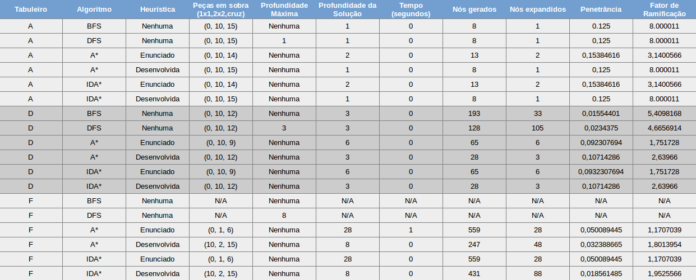

# **Manual Técnico**

<br /><br />

### _Unidade Curricular: Inteligência Artificial_ &nbsp;&nbsp;2017/2018


 Andreia Pereira nº 150221021 <br/>
 Lucas Fischer nº 140221004

<div style="page-break-after: always;"></div>

<h1>Tabela de Conteudos</h1>

* Introdução
* Estrutura do Projeto
* Detalhes de Implementação
* Estudos de Algoritmos
* Documentação das Funções
* Conclusão

<div style="page-break-after: always;"></div>

<h1>1- Introdução</h1>

 Blokus-Uno é uma aplicação desenvolvida em Common Lisp para a unidade curricular de Inteligência Artificial. A aplicação consiste num programa que tem como objetivo encontrar uma solução para um determinado problema, sendo esta solução a de caminho mais curto ou a de menor custo. <br/> <br /> Para o contexto da aplicação, o problema a solucionar enquadra-se no jogo do Blokus, mais específicamente em encontrar uma solução que permita chegar a um estado onde o jogador não tenha mais possibilidade de jogar.

<br /><br />

<h1>2- Estrutura do Projeto</h1>

 De modo a facilitar a compreensão e a manutenção do código desenvolvido para esta aplicação, a mesma está dividida em três ficheiros _**.lisp**_, estes são:

* <b>_puzzle.lisp_</b> - Neste ficheiro estão situadas todas as funções que modelam o dominio problema a solucionar, é neste ficheiro que está implementado o código dependente do dominio do problema. O ficheiro puzzle.lisp consta com funções que permitem: **estruturar um tipo de dados para o problema**, **definir os operadores do problema**, **identificar o nó objetivo**, **calcular o valor heurístico de um nó**, entre outras funções.

<br/>

* <b>_procura.lisp_</b> - O ficheiro procura.lisp é o ficheiro onde estão situadas as funções que implementam os **algoritmos de procura em espaço de estados**, **os sucessores**, **calculo da efiência dos algoritmos** e outras funções auxiliares dos algoritmos de procura em espaço de estados. As funções presentes neste ficheiro são independentes do dominio do problema, podendo ser reutilizadas para outros problemas. O ficheiro procura.lisp é o ficheiro que apresenta um maior teor teórico relevante para a unidade curricular de **Inteligência Artificial**

<br/>

* <b>_projeto.lisp_</b> - Este ficheiro é responsável por orquestrar os restantes ficheiros, carregando as funções presentes nos outros ficheiros para memória e compilando-as de modo a que se tornem executáveis. É também neste ficheiro que decorre a implementação do código responsável pela interação com o utilizador e com a leitura e escrita de ficheiros.

<br/>

* <b>_estatisticas.dat_</b> - O ficheiro estatisticas.dat é onde podem ser consultadas todas as métricas de eficiência (bem como outras informações) provenientes da execução da aplicação para um determinado problema.

<br/>

* <b>_problemas.dat_</b> - Neste ficheiro estão presentes todos os tabuleiros iniciais possíveis para a execução da aplicação. Consiste numa série de listas que representam um tabuleiro separadas por um separador legal.

<br/>

```
blokus-uno/
        ├── projeto.lisp ; Ficheiro onde é iniciada a aplicação
        ├── procura.lisp ; Contem a implementação dos algoritmos
        ├── puzzle.lisp	; Contem as funções do domínio do problema
        ├── estatisticas.dat ; Ficheiro que contem logs das estatisticas
        └── problemas.dat ; Ficheiro com os tabuleiros iniciais do problema
```

<br/><br/>

<h1>Detalhes da Implementação</h1>

 Dado que Common Lisp é uma linguagem de programação de natureza funcional o desenvolvimento da aplicação consistiu em desenvolver código num paradigma funcional, deste modo algumas técnicas como sequênciação, ciclos e atribuição não foram utilizadas para poder-se focar na recursividade e desenvolvimento de funções. Embora tenham sido permitidas algumas utilizações especiais de ciclos e atribuições, estes não foram utilizados.

<br/><br/>

<h1>Estudo dos Algoritmos</h1>

 Um dos objetivos principais no desenvolvimento deste projeto é construir uma ferramenta que não só desse a solução para um problema como também podesse dar alguma informação relevante para a comparação de eficiência de algoritmos, de modo a que os utilizadores possam ter uma noção mais prática do que consistem estas métricas de eficiência.

<br/>

 Para a comparação de eficiência de algoritmos foram utilizadas as seguintes métricas:

* <b>Número de nós gerados</b> - O número de nós que foram gerados pelo algoritmo até este encontrar o nó objetivo


* <b>Número de nós expandidos</b> - O número de nós que foram gerados pelo algoritmo até este encontrar o nó objetivo


* <b>Penetrância</b> - **P = Tamanho da Solução / Nós gerados** . Esta métrica consiste na razão entre o número de nós que pertencem ao conjunto de nós que constituem a solução do problema e o número total de nós gerados, o que nos dá uma boa percepção do número de nós, sem significado para a solução do problema, que foram gerados até se encontrar o nó objetivo. <br/> O valor da penetrância varia entre **[0,1]** em que 1 seria o valor ideal para esta métrica. Ex:. P = 0.5, conclui-se que 50% dos nós que foram gerados não têm fazem parte do conjunto de nós que constitui a solução


* <b>Fator de Ramificação</b> - **( B / B-1 ) * ( B^L - 1) = T**. É necessário resolver esta equação em ordem a B para nos dar o valor de ramificação médio da árvore de estados do problema, mas dado a impraticabilidade de calcular esta equação, são aplicados métodos computacionais de modo a conseguir resolve-la aproximadamente. Neste projeto foi implementado o método da bisseção para o calculo do fator de ramificação. <br/> Esta métrica representa o número de sucessores que, em média, cada nó terá e corresponde a um valor pertencente ao intervalo de **[1,+00[**.

* <b>Tempo de Execução</b> - Talvez a métrica mais intuitiva, o tempo de execução cronometra o tempo que o algoritmo demorou até devolver uma solução, logo, quanto menos tempo o algoritmo demorar melhor.

Para a comparação de estes algoritmos foi elaborada uma tabela comparativa de modo a facilitar a percepção e comparação entre os algoritmos:



Esta tabela oferece-nos bastantes informações importantes para a comparação dos algoritmos e também das heuristicas.
<br/><br/>
Analisando a tabela podemos concluir que os algoritmos **A*** e **IDA*** com a heurística desenvolvida pelo grupo proporcionam valores iguais ou superiores em comparação com os algoritmos **BFS**, **DFS** e **A*** e **IDA*** com a heurística dada pelo enunciado, o que faz destes algoritmos os mais eficiências **se** tiver uma boa heurística a auxlia-los.
<br/><br/>
Para o tabuleiro A podemos constatar que executando os algoritmos **A*** e **IDA***, com uma heurística que não seja ótima (como é o caso da heurística dada no enunciado), têm uma eficiência menor do que os algoritmos **BFS** e **DFS**, expandindo mais nós, gerando mais nós, e não encontrando a solução mais curta.
<br/><br/>
Algo também importante de se notar torna-se visível nos estudos para o tabuleiro D e F, que é o facto da explosão combinatória começar a aumentar exponencialmente nestes tabuleiros fazendo com que o algoritmo **BFS** e **DFS** tenham eficiências inferiores aos algoritmos **A*** e **IDA*** com heurísticas não ótimas, o que não acontecia no tabuleiro A visto que a solução encontrava-se no primeiro nível da árvore de estados evitando assim o aumento da explosão combinatória para este tabuleiro. Com isto em conta podemos afirmar que o algoritmo **BFS** e **DFS** tornam-se cada vez menos eficientes à medida que a explosão combinatória aumenta, e até mesmo impraticáveis (como é o caso do tabuleiro F em que estes algoritmos não foram capazes de devolver uma resposta devido a limitações de recursos do computador).
<br/><br/>
Outra comparação importante de se fazer é entre os algoritmos **A*** e **IDA***. Já concluimos que estes sãos os algoritmos mais eficiêntes quando equipados com uma "boa" heurística (mesmo que não seja admissível), mas que conclusões podemos tomar comparando estes dois algoritmos entre si? É importante ter em conta que o algoritmo **IDA*** é apenas uma variante do **A*** por isso estes algoritmos chegam, obrigatóriamente, à mesma solução, onde vairam é apenas na sua implementação e a sua preocupação com a memória utilizada e o tempo de CPU utilizado. Vamos considerar que estamos a utilizar a heurística desenvolvida pelo grupo e que estamos a solucionar o problema para o tabuleiro F, à primeira vista podemos constatar que o **IDA*** gerou quase o dobro dos nós gerados pelo **A***, expandiu quase o dobro dos nós expandidos pelo **A***, teve valores de penetrância inferiores ao **A*** e um fator de ramificação superiro ao **A***, tudo indicios de que o **IDA*** poderá ser menos eficiênte que o **A***, mas no entanto temos que compreender um aspecto muito importante sobre a implementação do **IDA***. O **IDA*** é implementado com o objetivo de ser mais eficiênte com a sua utilização de memória guardando em memória apenas um número de nós igual ao maior ramo explorado, mesmo que para isso tenha que utilizar mais tempo de CPU para voltar a expandir e gerar vários nós novamente. Em diversos problemas (tal como no problema apresentado para este projeto) este _trade off_ entre memória e tempo de CPU é bastante vantajoso visto que o tempo de CPU é um recurso muito mais disponível que memória, por isso podemos concluir que entre os algoritmos **A*** e **IDA*** a decisão sobre qual é o mais eficiênte pode variar consoante o domínio do problema, caso queiramos ser mais eficiêntes com a memória então o **IDA*** é a melhor escolha, caso queiramos expandir e gerar o menor número de nós possíveis então o **A*** é a melhor escolha.
<br/><br/>
**Concluindo**, todos os algoritmos desenvolvidos têm o seu ponto forte e o seu ponto fraco, mas para combater o problema de explosão combinatória é favorável utilizarmos algoritmos informados como o **A*** e **IDA*** equipados com uma boa heurística.