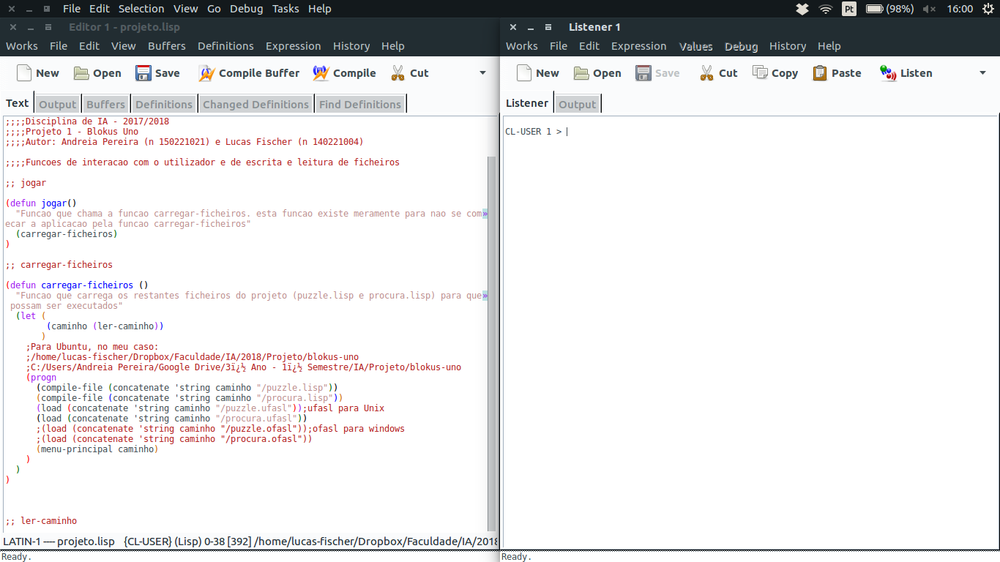
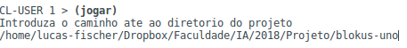
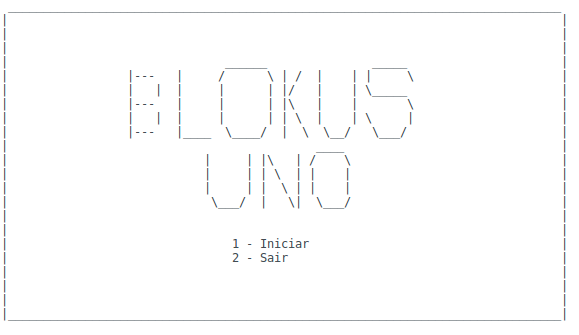
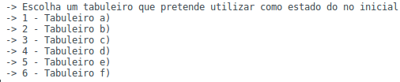
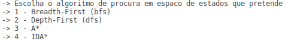
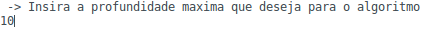
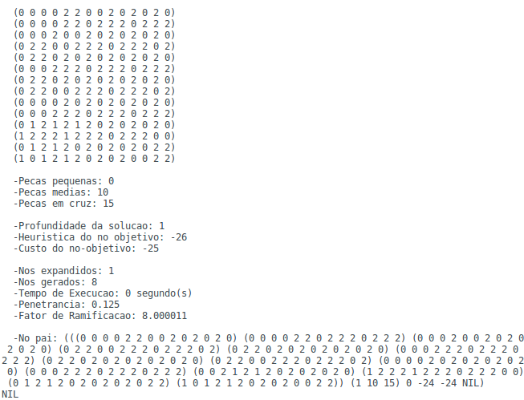

<link rel="stylesheet" type="text/css" media="all" href="./styles.css" />

# **&nbsp;&nbsp;&nbsp;&nbsp;&nbsp;Manual de Utilizador**

  

## _Unidade Curricular: Inteligência Artificial_ &nbsp;&nbsp;2017/2018

### Andreia Pereira nº 150221021
### Lucas Fischer nº 140221004

    

<h1>1- Descrição da aplicação</h1>

### Blokus-Uno é uma aplicação que simula o jogo de blokus com algumas alterações às suas regras. O aplicação tem como objetivo encontrar para, um determinado tabuleiro, qual a solução optima ou de menor custo para chegar ao fim do jogo.

    

<h1>2- Iniciar a Aplicação</h1>

### Para poder dar iniciar a aplicação necessita de abrir o ficheiro _**projeto.lisp**_ no IDE _**LispWorks**_.  Uma vez aberto deverá estar à semelhança da seguinte foto

 
### De modo a que consiga iniciar a aplicação, tem que primeiro compilar as suas funções, para isso carregue no botão que diga "Compile Buffer": 

 

### Está agora pronto para iniciar esta fantástica aplicação! Comece por executar a função `(jogar)` no painel chamado _**Listner**_ e de seguida insira o caminho para a diretoria principal da aplicação. (ex: C:/Users/_NOME DO UTILIZADOR_/Documentos/blokus-uno) e carregue na tecla enter.

### Irá ver que a aplicação foi bem compilada e de seguida será-lhe apresentado um menu principal onde poderá dar inicio à aplicação.

### Neste mágnifico menú principal pode escolher uma de duas opções:
1. **Iniciar** - Esta opção dará inicio à aplicação, levando-lhe para outros menús onde tem a possibilidade de escolher qual o **tabuleiro inicial** que deseja, qual o **algoritmo** de procura que deseja, qual a **heuristica** que deseja e qual a **profundidade máxima** que deseja (caso tenha selecionado o algoritmo _Depth First_)

2. **Sair** - Como pode deduzir, esta opção leva ao término da aplicação, parando a sua execução.

    

<h1>3- Utilização da Aplicação</h1>

### Escolhendo a opção de **Iniciar** a aplicação a aplicação irá leva-lo para outros menús onde irá ser questionado sobre as escolhas que pretende fazer na execução da aplicação.   Estes menús são:
* <b>Escolha do tabuleiro inicial</b>

 
Onde pode escolher qual o tabuleiro que pretende que sreja o tabuleiro inicial

  

* <b>Escolha do algoritmo de procura em espaço de estados</b>

 
Neste menú pode escolher um dos quatro algoritmos de procura em espaço de estados disponíveis na aplicação

  

* <b>Escolha da profundidade máxima da árvore de procura (caso tenha escolhido o algoritmo Depth-First)</b>

 
Caso tenha escolhido o algoritmo _Depth First_ no menú anterior será-lhe questionado qual a profundidade máxima que pretende que este algoritmo vá. A título de exemplo foi inserido a profundidade máxima de 10 mas o valor inserido é qualquer número positivo que desejar

  

### Após responder a estas questões poderá ver a magia a acontecer, será-lhe apresentado algo com o seguinte aspeto:

### Muito bem, mas o que quer dizer toda esta informação ? Não se preocupe, ficará a saber tudo já a seguir !