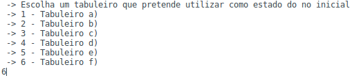
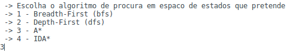
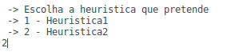
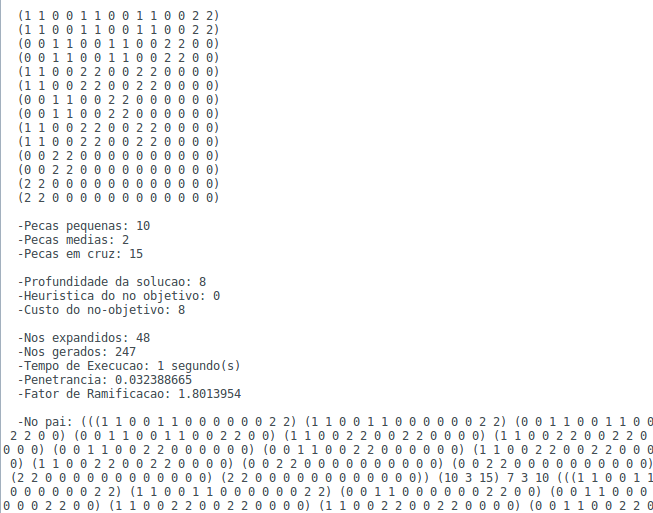
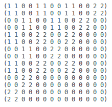
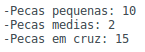
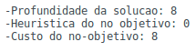
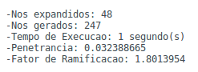
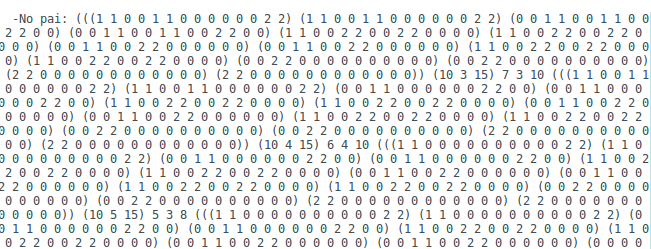
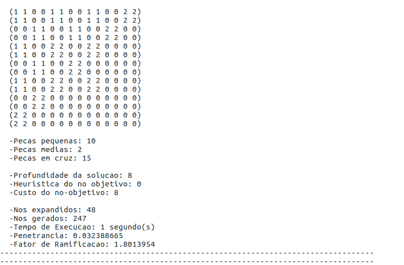

<link rel="stylesheet" type="text/css" media="all" href="./styles.css" />

# **&nbsp;&nbsp;&nbsp;&nbsp;&nbsp;Manual de Utilizador**

  

## _Unidade Curricular: Inteligência Artificial_ &nbsp;&nbsp;2017/2018

### Andreia Pereira nº 150221021
### Lucas Fischer nº 140221004

    

<h1>1- Descrição da aplicação</h1>

### Blokus-Uno é uma aplicação que simula o jogo de blokus com algumas alterações às suas regras. O aplicação tem como objetivo encontrar para, um determinado tabuleiro, qual a solução optima ou de menor custo para chegar ao fim do jogo.

    

<h1>2- Iniciar a Aplicação</h1>

### Para poder dar iniciar a aplicação necessita de abrir o ficheiro _**projeto.lisp**_ no IDE _**LispWorks**_.  Uma vez aberto deverá estar à semelhança da seguinte foto

 
### De modo a que consiga iniciar a aplicação, tem que primeiro compilar as suas funções, para isso carregue no botão que diga **"Compile Buffer"**: 

 

### Está agora pronto para iniciar esta fantástica aplicação! Comece por executar a função `(jogar)` no painel chamado _**Listner**_ e de seguida insira o caminho para a diretoria principal da aplicação. (ex: C:/Users/_NOME DO UTILIZADOR_/Documentos/blokus-uno) e carregue na tecla enter.

### Irá ver que a aplicação foi bem compilada e de seguida será-lhe apresentado um menu principal onde poderá dar inicio à aplicação.

### Neste mágnifico menú principal pode escolher uma de duas opções:
1. **Iniciar** - Esta opção dará inicio à aplicação, levando-lhe para outros menús onde tem a possibilidade de escolher qual o **tabuleiro inicial** que deseja, qual o **algoritmo** de procura que deseja, qual a **heuristica** que deseja e qual a **profundidade máxima** que deseja (caso tenha selecionado o algoritmo _Depth First_)

2. **Sair** - Como pode deduzir, esta opção leva ao término da aplicação, parando a sua execução.

    

<h1>3- Utilização da Aplicação</h1>

### Escolhendo a opção de **Iniciar** a aplicação a aplicação irá leva-lo para outros menús onde irá ser questionado sobre as escolhas que pretende fazer na execução da aplicação.   Estes menús são:
* <b>Escolha do tabuleiro inicial</b>

 
Onde pode escolher qual o tabuleiro que pretende que sreja o tabuleiro inicial

  

* <b>Escolha do algoritmo de procura em espaço de estados</b>

 
Neste menú pode escolher um dos quatro algoritmos de procura em espaço de estados disponíveis na aplicação

  

* <b>Escolha da profundidade máxima da árvore de procura (caso tenha escolhido o algoritmo Depth-First)</b>

 
Caso tenha escolhido o algoritmo _Depth First_ no menú anterior será-lhe questionado qual a profundidade máxima que pretende que este algoritmo vá. A título de exemplo foi inserido a profundidade máxima de 10 mas o valor inserido é qualquer número positivo que desejar

  

* <b>Escolha da heuristica a utilizar (caso tenha escolhido o algoritmo A* ou IDA*)</b>
 

 
Neste menú pode escolher qual a heuristica que pretende utilizar caso tenha escolhido o algoritmo **A*** ou **IDA***. A Heuristica é uma função que irá ajudar estes algoritmos de procura a "filtrar" alguns nós que não sejam tão relevantes para o problema.

  

### Após responder a estas questões poderá ver a magia a acontecer, será-lhe apresentado algo com o seguinte aspeto:

### Muito bem, mas o que quer dizer toda esta informação ? Não se preocupe, ficará a saber tudo já a seguir!

    

<h1>4- Interpretação do Resultado</h1>

### Agora que já tem o resultado da execução da aplicação falta-lhe apenas saber interpretar os dados fornecidos por este resultado. Vamos passo a passo explicar-lhe cada um.

* <b>Estádo do nó objétivo</b>
 

 
A primeira informação que encontramos refere-se ao estádo do nó objétivo, isto é, para este problema, o tabuleiro no qual o algoritmo de procura terminou, que corresponde a um tabuleiro onde o jogador não consegue por mais nenhuma das suas peças (representadas pelo número 1).

  

* <b>Peças restantes do nó objétivo</b>
 

 
Estas três linhas indicam-lhe as peças que o jogador ainda tinha quando chegou ao nó objétivo. O jogo inicia-se com **10 peças pequenas**, **10 peças médias** e **15 peças em cruz** por isso deixamos-lhe fazer as contas para determinar quantas peças foram usadas.

  

* <b>Informação sobre o custo, heuristica e profundidade</b>
 

 
As seguintes três linhas do resultado dão-lhe informação sobre a profundidade em que se encontrava o nó objétivo, o valor heuristico que esse nó objétivo tinha (o ideal é que o valor seja **0** nos nós objétivos), e o custo necessário para que se consiga chegar desde o nó inicial até este nó objétivo.

  

* <b>Informação sobre a eficiência do algoritmo</b>
 

 
Esta porção do resultado dá-lhe informação sobre a eficiência que o algoritmo obteve, cálculada através de métricas como **Penetrância** e **Fator de ramificação médio**, estas métricas involvem formulas matemáticas complexas por isso poupamos-lhe o trabalho de ter que fazer as contas, não tem que agradecer.
  
**Nós expandidos** - Este valor indica quantos nós o algoritmo 
expandiu (gerou os seus sucessores) até que encontrasse um nó que fosse um nó objétivo (quantos menor este valor melhor)
  
**Nós gerados** - Os nós gerados são todos os nós que resultam da expansão de um nó, logo, quantos menos nós gerados menor será a memória utilizada pelo algoritmo.
  
**Tempo de Execução** - O tempo de execução, como é dito, é medido em segundos e como pode deduzir, quanto menor for o tempo de execução melhor é a eficiência do algoritmo.
  
**Penetrância** - A penetrância é um valor entre **0** e **1** que permite-lhe ter uma noção sobre a relação entre quantos nós foram gerados e quantos nós fazem realmente parte do caminho da solução do problema. O ideal será ter uma penetrância de valor 1 o que significa que todos os nós que foram gerados fazem parte da solução do problema.
  
**Fator de ramificação médio** - Esta métrica consiste num valor entre **1** e **mais infinito (+00)** e representa o número de sucessores que, em média, cada nó possui.

  
* <b>Informação sobre o nó pai do nó objétivo</b>

 
A última informação que o resultado lhe apresenta é uma lista (que pode ser enorme) que corresponde ao nó pai do nó objétivo. Neste nó pai pode por sua vez ver o nó pai desse nó e assim sucessivamente até chegar ao nó raiz por isso é uma informação útil que lhe permite obter o caminho de solução que o algoritmo percorreu até encontrar o nó objétivo.

    

<h1>5- Ficheiro estatisticas.dat</h1>

### Para que não tenha que estar sempre a repetir todos estes passos e estar constantemente a executar a aplicação, esta mesma escreve os resultados tal como apresentados anteriormente, num ficheiro situado na diretoria principal do projeto denominado _**estatisticas.dat**_.

    

<h1>6- Conclusão</h1>

### Agora que já concluiu a leitura deste manual já possui todas as capacidades para executar a aplicação e tirar toda a informação que precisa sobre ela, espero que goste !

### Happy coding from **Andreia Pereira** & **Lucas Fischer** !