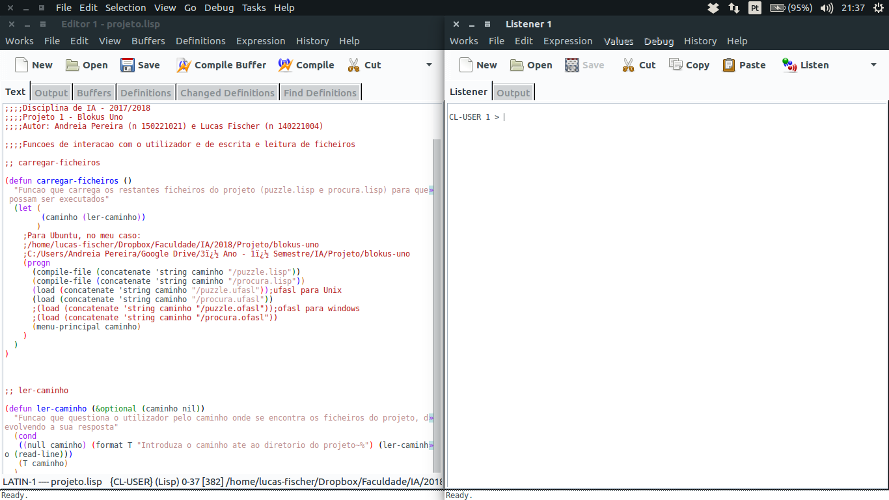
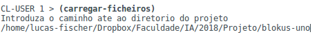

<link rel="stylesheet" type="text/css" media="all" href="./styles.css" />

# **&nbsp;&nbsp;&nbsp;&nbsp;&nbsp;Manual de Utilizador**

  

## _Unidade Curricular: Inteligência Artificial_ &nbsp;&nbsp;2017/2018

### Andreia Pereira nº 150221021
### Lucas Fischer nº 140221004

    

<h1>1- Descrição da aplicação</h1>

### Blokus-Uno é uma aplicação que simula o jogo de blokus com algumas alterações às suas regras. O aplicação tem como objetivo encontrar para, um determinado tabuleiro, qual a solução optima ou de menor custo para chegar ao fim do jogo.

    

<h1>2- Iniciar a Aplicação</h1>

### Para poder dar iniciar a aplicação necessita de abrir o ficheiro _**projeto.lisp**_ no IDE _**LispWorks**_.  Uma vez aberto deverá estar à semelhança da seguinte foto

 
### De modo a que consiga iniciar a aplicação, tem que primeiro compilar as suas funções, para isso carregue no botão que diga "Compile Buffer": 

 

### Está agora pronto para iniciar esta fantástica aplicação! Comece por executar a função `(carregar-ficheiros)` no painel chamado _**Listner**_ e de seguida insira o caminho para a pasta principal da aplicação. (ex: C:/Users/_NOME DO UTILIZADOR_/Documentos/blokus-uno) e carregue na tecla enter.

